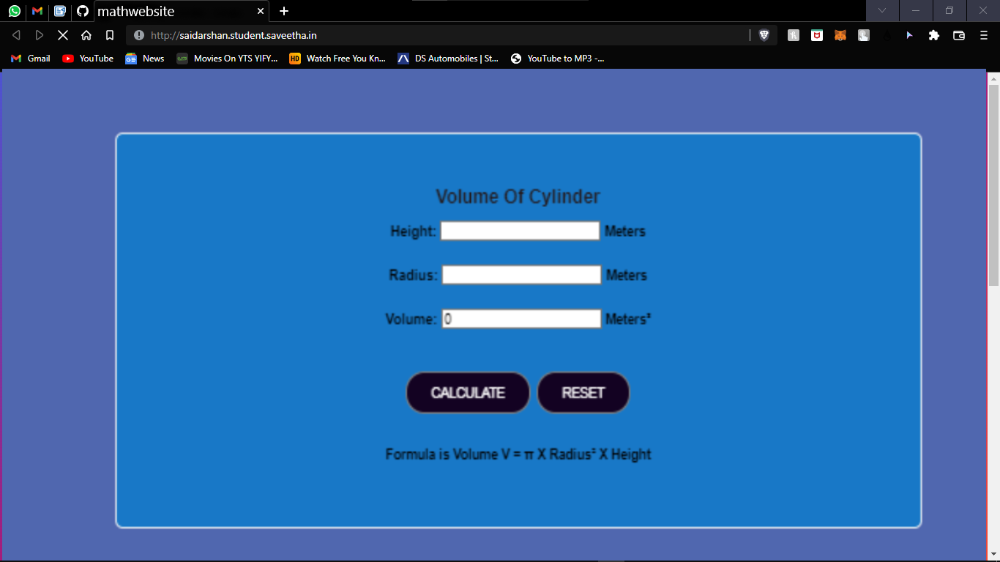

# Design a Website for Server Side Processing

## AIM:
To design a website to perform mathematical calculations in server side.

## DESIGN STEPS:

### Step 1:
Desing your website for calculation using wireframe work.
### Step 2:
Then to execute the wireframe work desing use HTML,CSS.
### Step 3:
Use views.py to execute the coding in serverside.
### Step 4:
Use views.py to execute the coding in serverside.
### Step 5:
Publish the website in the given URL.
### PROGRAM :
```
Volume.html:
<!DOCTYPE html>
<html>
<head>
    <meta charset='utf-8'>
    <meta http-equiv='X-UA-Compatible' content='IE=edge'>
    <title>mathwebsite</title>
    <meta name='viewport' content='width=device-width, initial-scale=1'>
    <script src='main.js'></script>
    <style>
.container {
  width: 1080px;
  margin-left: auto;
  margin-right: auto;
  padding-top: 200px;
  padding-left: 300px;
}
.content {
  display:block;
  width: 500px;
  min-height: 300px;
  font-size: 20px;
  background-color:white;
}
h1{
    color: blue;
    text-align: center;
    padding-top: 25px;
}
.formelement{
    color: blue;
    text-align: center;
    margin-top: 5px;
    margin-bottom: 5px;
}
    </style>
</head>
<body>
    <div class="container">
    <div class="content">
    <h1>VOLUME OF A CYLINDER</h1>
    <form method="POST">
        
        <div class="formelement">
        Length : <input type="text" name="Height" value="{{l}}"></input>Meters<br/>
        </div>
        <div class="formelement">
        Breadth : <input type="text" name="Radius" value="{{b}}"></input>Meters<br/>
        </div>
        <div class="formelement">
        <input type="submit"  value="Calculate Volume"></input><br/>
        </div>
        <div class="formelement">
        Volume : <input type="text" name="volume" value="{{volume}}"></input>Meter<sup>3</sup><br/>
        </div>
    </form>
    </div>
    </div>
</body>
</html>


Views.py:
from django.shortcuts import render
import numpy as n
# Create your views here.
def volumecalculation(request):
    context={}
    context['volume'] = "0"
    context['h'] = "0"
    context['r'] = "0"
    if request.method == 'POST':
        l = request.POST.get('Height','0')
        b = request.POST.get('Radius','0')
        volume = n.pi*n.sqrt.int(r)*int(h)
        context['volume'] = volume
        context['h'] = h
        context['r'] = r
    return render(request,'mathapp/volume.html',context)
 

urls.py:
from django.contrib import admin
from django.urls import path
from mathapp import views

urlpatterns = [
    path('admin/', admin.site.urls),
    path('volumeofacuboid/',views.volumecalculation,name="volumeofaculinder"),
    path('',views.volumecalculation,name="volumeofacylinderroot")
]
```
## OUTPUT:

## Result:
A website to perform mathematical calculations in server side is created.